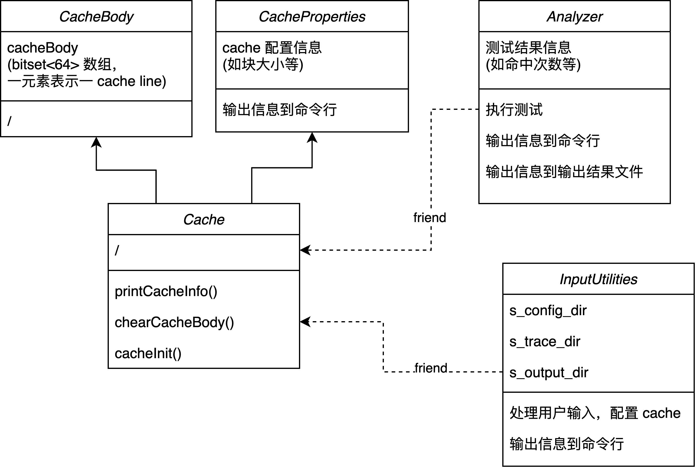
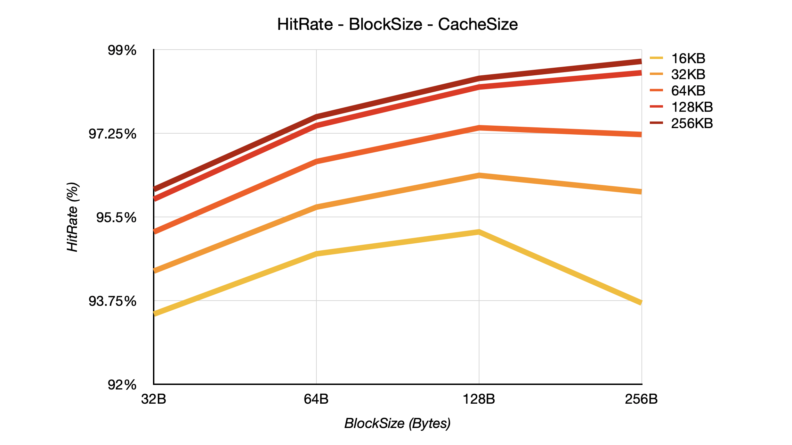
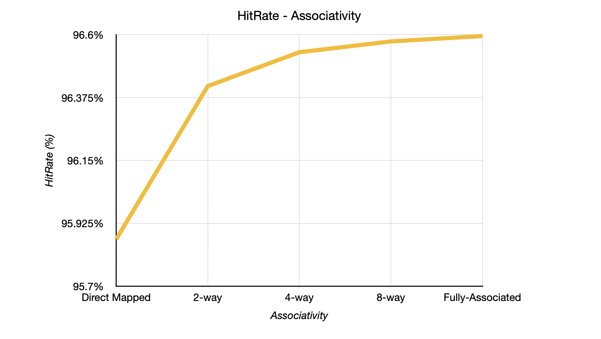
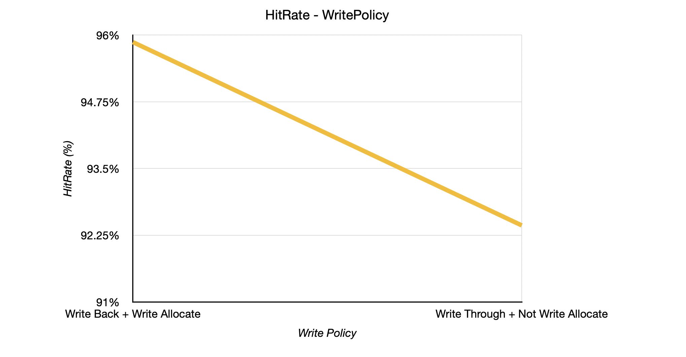
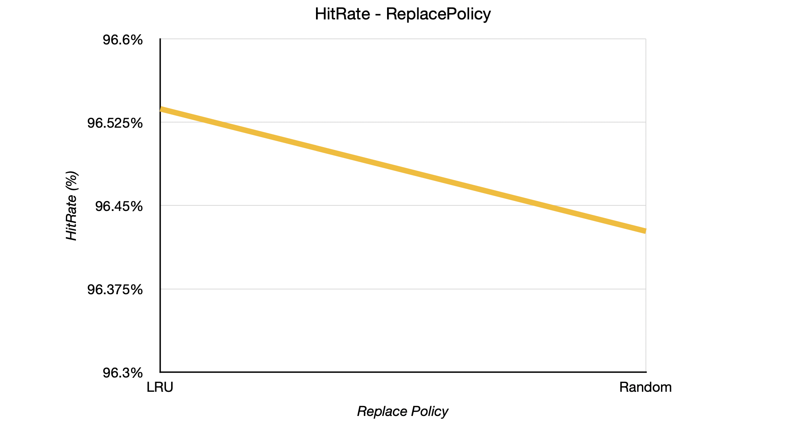

# Cache Simulator
> This is a project of Computer Architecture, 2023 Spring, Fudan Univ.
> Also a project of cse240a, UCSD.


## 项目概述

### 构建及运行

本项目支持 C++20、cmake 3.15，在 Clang++ 14.0.3 及 g++ 13.1.0 下均已测试通过。

**构建方式**

```shell
cd build
make clean
make
```

**运行**

构建后的可执行程序位于 `./build` 路径下。支持三个输入选项 `-t`、`-c`、`-o`，分别表示 trace 文件路径、cache config 文件路径、输出结果文件路径，其中， `-t`、`-c` 是必须选项。如下。

```shell
./build/CacheSimulator -t <PATH_OF_TRACE_FILE> -c <PATH_OF_CONFIG_FILE> -o <PATH_OF_OUTPUT_FILE>
```

运行后，命令行中将得到本次测试中 cache 的配置信息“Cache Info”、分析得到的命中率及总访问时间等指标“Analyzer Info”，同时将将结果写入输出结果文件（若有）。下方是一个测试结果案例：

1. 命令行输出

   ```
   Configuration file direction: /Users/lianyunrui/Desktop/Study/College-Project/3_2/Computer-Architecture/Lab/Lab_4/project/confs/8B-2way-8KB-lru-50-wb-wa.txt
   Trace file direction: /Users/lianyunrui/Desktop/Study/College-Project/3_2/Computer-Architecture/Lab/Lab_4/project/traces/ls.trace
   Output file direction: /Users/lianyunrui/Desktop/Study/College-Project/3_2/Computer-Architecture/Lab/Lab_4/project/build/../out.txt
   ===============================================
   ===================Cache Info==================
   Cache size: 8 KB
   Cache block size: 8 B (i.e. line size ignoring tag & flags)
   Cache line size: 13 B (i.e. line size including tag & flags)(round to upper bound)
   Cache line number of each set: 2
   Cache set number: 512
   Cache line number: 1024
   Type of association: N-way set associative
   Type of replacement: LRU
   Type of write policy: Write back & Write allocate
   Miss penalty: 50 cycles
   Cache line size: 102 bit (i.e. line size including tag & flags)
   Bits for line offset in address: 0 bit
   Bits for in-block offset in address: 3 bit
   Bits for set offset in address: 9 bit
   Bits for tag in address: 36 bit
   ===============================================
   
   ===============================================
   ================Analyzer Info==================
   Number of cache access: 244076
   Number of cache read: 170693
   Number of cache write: 73383
   Number of cache hit: 211931
   Number of cache read hit: 147338
   Number of cache write hit: 64593
   Number of memory read: 32145
   Number of memory write: 9763
   Average cache hit rate: 86.8299%
   Average cache read hit rate: 86.3175%
   Average cache write hit rate: 88.0217%
   Total cache access cycles: 2339476 cycles
   Average cache access cycles: 9.58503 cycles
   ===============================================
   ```

2. 输出结果文件

   ```shell
   Total Hit Rate: 86.8299%
   Load Hit Rate: 86.3175%
   Store Hit Rate: 88.0217%
   Total Run Time: 2339476
   AVG MA Latency: 9.59
   ```

本项目也提供了一些控制变量的对比实验测试脚本，位于 `./scripts` 路径下，这些脚本的输出文件将位于 `./results` 路径下，具体文件名见命令行输出。如下。

```sh
sh scripts/<A_TEST_SCRIPT>	# in the following case, <A_TEST_SCRIPT> = associativity.sh     
```

下方是一个测试结果案例，输出文件过长，此处不展示。命令行输出：

```
Associativity test start!
direct-mapped done!
2-way done!
4-way done!
8-way done!
fully-associated done!
Associativity test done!
formatted results with cache information have been written to ./results/associativity.txt
```

### 项目结构

文件路径及功能如下。

```
.
├── CMakeLists.txt
├── build
│   └── ...								# 构建相关文件，包括可执行文件
├── confs
│   └── ...								# 测试使用的 cache config 文件，用于配置 cache 参数
├── include
│   ├── analyzerUtils.h		# 与 cache 行为测试、处理文件输出相关的所有类及函数声明
│   └── cacheUtils.h			# 与 cache 参数配置、处理用户输入相关的所有类及函数声明，及所有的宏
├── results
│   ├── formattedOutputFiles
│   │   └── ...						# ./script/ 中脚本的简要运行结果（只含实验要求的五行输出）
│   └── ...								# ./script/ 中脚本的详细运行结果（包括 cache 参数说明等信息）
├── scripts
│   └── ...								# 控制变量的对比测试，详见「对比实验」
├── src
│   ├── base.cpp					# 处理命令行输出、进行一些简单的计算、所有类的构造及析构
│   ├── cacheBuildUp.cpp	# 初始化 cache（清空 cache 内容）
│   ├── inputUtils.cpp		# 处理用户输入、cache 配置文件读取
│   ├── main.cpp
│   ├── replaceUtils.cpp	# 处理不同替换策略（LRU / random）的行为
│   └── traceFileTest.cpp	# 读取 trace 文件，执行测试，保存结果
└── traces
    └── ...
```


## 项目细节

### 约定

以下对本项目做必要说明，以免误读。

- **只模拟 dCache 行为**

  本项目只模拟了 dCache 的行为，即，只考虑了数据地址访问对 cache 的影响，忽略指令地址访问对 cache 的影响。由于多数处理器中 L1-iCache 与 L1-dCache 分离，故指令地址访问对 dCache 是没有影响的，故本项目中忽略之。

- **config file 格式**

  config file 按照如下形式编写，每项一行。

  1. **块大小 block size：**以字节为单位的缓存块大小，即缓存行 (cache line) 中去除标记 tag、标志位 flags (valid + dirty)，该值应该是$2^k$。
  2. **关联性：**指定缓存的关联性。值“1”表示直接映射缓存，而值“0”表示完全关联，其他值可以为2的非负幂次，代表$2^k$组相联。
  3. **数据大小：**指定缓存中数据的总大小。这不包括任何开销 (tag、flags)，以KB为单位且值为$2^k$。
  4. **替换政策：**指定要使用的替换策略。值“0”表示随机替换，值“1”表示LRU,其余值无效。注意若直接映射，则此项不起作用。
  5. **写策略：**值“0”表示命中时写直达 (write through)、非命中时非写分配 (not write allocate)；值“1”表示命中时写回 (write back)、非命中时写分配 (write allocate)。

- **缓存行组织形式、地址组织形式**

  本项目在读取 cache config file 之后会输出 cache 的各项配置，其中会将给出缓存行长度 (包括 tag、flags)、地址各字段所占位数。

  - **缓存行**

    由于本项目仅作为缓存行为模拟器，并不需要如实构造缓存行，以下仅是不同情况下理论上的缓存行构造，在命令行输出中也会给出详细信息。

    1. 若为 write through + not write allocate策略，缓存行按照如下形式组织

       ```
       -----------------------------------------------------------
       | valid bit |				tag				|						data						|
       -----------------------------------------------------------
       ```

    2. 若为 write through + not write allocate策略，缓存行按照如下形式组织

           -----------------------------------------------------------
           | valid bit | dirty bit |			tag			|				data				|
           -----------------------------------------------------------

  - **地址**

    1. 若为直接映射，地址按照如下形式组织

       ```
       |		tag		|		line_offset		|		block_offset		|
       ```

    2. 若为组相联映射，地址按照如下形式组织

       ```
       |		tag		|		set_offset		|		block_offset		|
       ```

    3. 若为全相联映射，地址按照如下形式组织

       ```
       |						tag							|		block_offset		|
       ```

- **写策略说明**

  1. **write through + not write allocate：**

     命中时：同时写入 cache 和主存。

     不命中时：直接写主存。

  2. **write back + write allocate：**

     命中时：只写 cache 不写主存，并写 dirty bit = 1。

     不命中时：将主存数据加载进 cache，进行命中的写。

### 主要逻辑及主要函数调用

类之间关系如下。`main` 中通过 `InputUtilities` 类来配置 cache 信息，并通过 `Analyzer` 类来执行测试，并得到测试结果。

```c++
// in main(int argc, char *argv[])
inputUtil.setCacheProperties(argc, argv, cache);
string traceDir = inputUtil.getTraceDir();
string outputDir = inputUtil.getOutputDir();
cache.cacheInit();
analyzer.traceFileTest(cache, traceDir);
```



主要逻辑、主要函数调用如下。

#### **`Analyzer.traceFileTest()`**

- 逐行读 trace 文件，对每行做 **`Analyzer.runOneInstruction()`**

#### `Analyzer.runOneInstruction()`

- 读命中
  - `i_num_cache_access++; i_num_cache_read++; i_num_cache_hit++; i_num_cache_read_hit++;`
  - 若 LRU，做 **`Analyzer.lruHit()`**（修改各缓存行的 LRU 优先级）
- 写命中
  - `i_num_cache_access++; i_num_cache_write++; i_num_cache_hit++; i_num_cache_write_hit++;`
  - 若 write through，做 **`Analyzer.writeMem()`**（模拟写主存，实际就是 `i_num_mem_write++;`）
  - 若 write back，设置 dirty_bit = 1
  - 最后，若 LRU，做 **`Analyzer.lruHit()`**（修改各缓存行的 LRU 优先级）
- 读不命中
  - `i_num_cache_access++; i_num_cache_read++;`
  - 做 **`Analyzer.readMem()`**（模拟读主存，包含替换操作等）
- 写不命中
  - `i_num_cache_access++; i_num_cache_write++;`
  - 若 not write allocate，做 **`Analyzer.writeMem()`**（模拟写主存，实际就是 `i_num_mem_write++;`）
  - 若 write allocate，做**`Analyzer.readMem()`**（模拟读主存，将主存数据加载进内存），设置 dirty_bit = 1（模拟命中的写）

#### `Analyzer.readMem()`

- 直接映射
  - 若目标行空闲（valid_bit = 0），valid_bit 改1，写 tag，写 dirty_bit = 0。（模拟替换 cache）
  - 若无空行，做 **`Analyzer.replace()`**（替换缓存行）
- 组相联映射
  - 若组内有空闲行（valid_bit = 0），valid_bit 改1，写 tag，写 dirty_bit = 0。（模拟替换 cache）
  - 若无空行，做 **`Analyzer.replace()`**（替换缓存行）
- 全相联映射
  - 若整个 cache 内有空闲行（valid_bit = 0），valid_bit 改1，写 tag，写 dirty_bit = 0。（模拟替换 cache）
  - 若无空行，做 **`Analyzer.replace()`**（替换缓存行）

#### `Analyzer.replace()`

- 直接映射
  - 若目标行 dirty_bit = 1，做 **`Analyzer.writeMem()`**（模拟写主存，实际就是 `i_num_mem_write++;`）
  - valid_bit 改1，写 tag，写 dirty_bit = 0。（模拟替换 cache）
- 组相联映射或全相联映射
  - 若 LRU，做 **`Analyzer.lruMiss_NoSpareLine()`**（找到替换目标行）
  - 若 random，做 **`Analyzer.randomMiss()`**（找到替换目标行）
  - 若目标行 dirty_bit = 1，做 **`Analyzer.writeMem()`**（模拟写主存，实际就是 `i_num_mem_write++;`）
  - valid_bit 改1，写 tag，写 dirty_bit = 0。（模拟替换 cache）


## 对比实验

本次实验中，对缓存命中率进行了4组对比实验，分别比较在其他条件相同时，块大小、cache 大小、缓存行关联度、替换策略、写策略，对缓存命中率的影响。

以下所有测试都给出了对应运行的脚本，详细运行结果（包括 cache 参数说明等信息）位于 `./results/`，简要运行结果（只含实验要求的五行输出）位于 `./results/simplifiedOutputFiles`。

#### 块大小、cache 大小

```shell
sh scripts/blockSize-cacheSize.sh 
```

- **预期结果**

  1. 其他条件相同时，在一定范围内，**块大小越大，命中率越高，但若块大小过大，命中率将降低**。因为由于局部性，块大小越大，访问的内存区域越容易已经被加载进缓存，但当块大小过大，可能导致缓存中存储的数据超出程序实际需要的范围，从而浪费了缓存空间。
  2. 其他条件相同时，**cache 大小越大，命中率越高**。因为 cache 大小越大，访问的内存区域越容易已经被加载进缓存。

- **测试结果**

  **测试控制其他条件为：**直接映射、write back + write allocate、LRU 替换策略。

  命中率表、折线图如下。

  |           | **32B**  | **64B**  | **128B** | **256B** |
  | :-------: | :------: | :------: | :------: | :------: |
  | **16KB**  | 93.4652% | 94.7258% | 95.1851% | 93.6966% |
  | **32KB**  | 94.3649% | 95.703%  | 96.3679% | 96.0238% |
  | **64KB**  | 95.1826% | 96.6572% | 97.3635% | 97.2218% |
  | **128KB** | 95.8681% | 97.409%  | 98.2153% | 98.5144% |
  | **256KB** | 96.0725% | 97.5917% | 98.3964% | 98.7537% |

  

  符合预期。值得注意的是，当 cache 大小较大时，所测试的块大小范围未出现命中率降低的情况，是由于 cache 大小增大带来的正向影响程度超过了块大小增大带来的负向影响。

#### 缓存行关联度

注意，全相联映射部分的测试运行需要一定时间，并非程序卡死。

```shell
sh scripts/associativity.sh 
```

- **预期结果**

  **命中率：**其他条件相同时，**缓存行关联度越高，命中率越高**。因为缓存行关联度越高，可供一内存块数据映射到的缓存位置增加，命中率升高。

- **测试结果**

  **测试控制其他条件为：**cache 大小 128KB、块大小 32B、write back + write allocate、LRU 替换策略。

  命中率表、折线图如下。

  | **Direct Mapped** | **2-way** | **4-way** | **8-way** | **Fully-Associated** |
  | :---------------: | :-------: | :-------: | :-------: | :------------------: |
  |     95.8681%      | 96.4159%  | 96.5371%  | 96.5757%  |       96.5949%       |

  

  符合预期。

#### 写策略

```shell
sh scripts/writePolicy.sh
```

- **预期结果：**其他条件相同时，**Write Back + Write Allocate 策略的命中率高于 Write Through + Not Write Allocate**。因为写不命中时，Write Allocate 策略会将内存数据加载到缓存中，再进行命中的写，这能提高之后的对本地址附近区域数据的访问的命中次数。

- **测试结果**

  **测试控制其他条件为：**cache 大小 128KB、块大小 32B、直接映射、LRU 替换策略。

  命中率表、折线图如下。

  | **Write Back + Write Allocate** | **Write Through + Not Write Allocate** |
  | :-----------------------------: | :------------------------------------: |
  |            95.8681%             |                92.4335%                |

  

  符合预期。

#### 替换策略

注意，随机替换策略下的命中率每次运行均不同。

```shell
sh scripts/replacePolicy.sh
```

- **预期结果：**本实验仅做了 LRU 策略、随机替换策略的比较。其他条件相同时，**前者的命中率应高于后者**。因为前者能更好地利用局部性，后者很可能将最近频繁使用的数据块替换掉。**但由于随机替换策略的随机性，可能出现前者低于后者的情况**。

- **测试结果**

  **测试控制其他条件为：**cache 大小 128KB、块大小 32B、4路组相联映射、write back + write allocate。

  命中率表、折线图如下。随机替换策略的命中率取10次测试平均值。

  | **LRU**  | **Random (average)** |
  | :------: | :------------------: |
  | 96.5371% |  96.4268888888889%   |

  

  符合预期。

  

## 正确性

基于[项目约定](###约定)中的名词定义，本项目已在小规模 trace 文件上人工计算验证正确。对于大规模 trace 文件（如本次使用的 `./traces/ls.trace` 等），本项目将结果与[参考项目](##参考)（该项目 star 数较高，一定程度上可作为参考）的输出作了对比，均一致。

值得注意的是，[参考项目](##参考)中的 write through + write allocate 策略行为与本项目的约定不同，使用该写策略的测试结果以本项目为准。


## 参考

1. https://github.com/jiangxincode/CacheSim